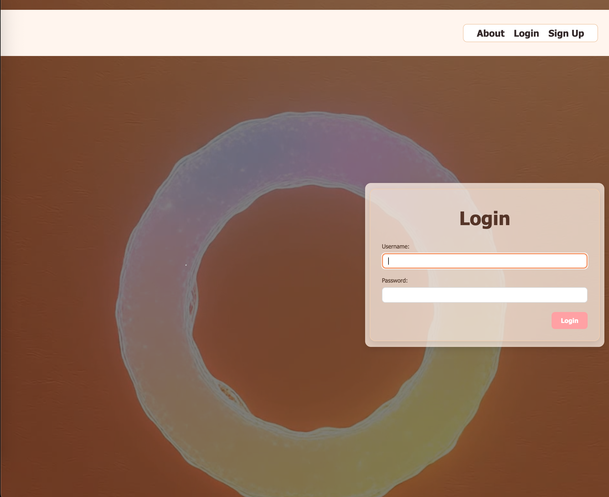
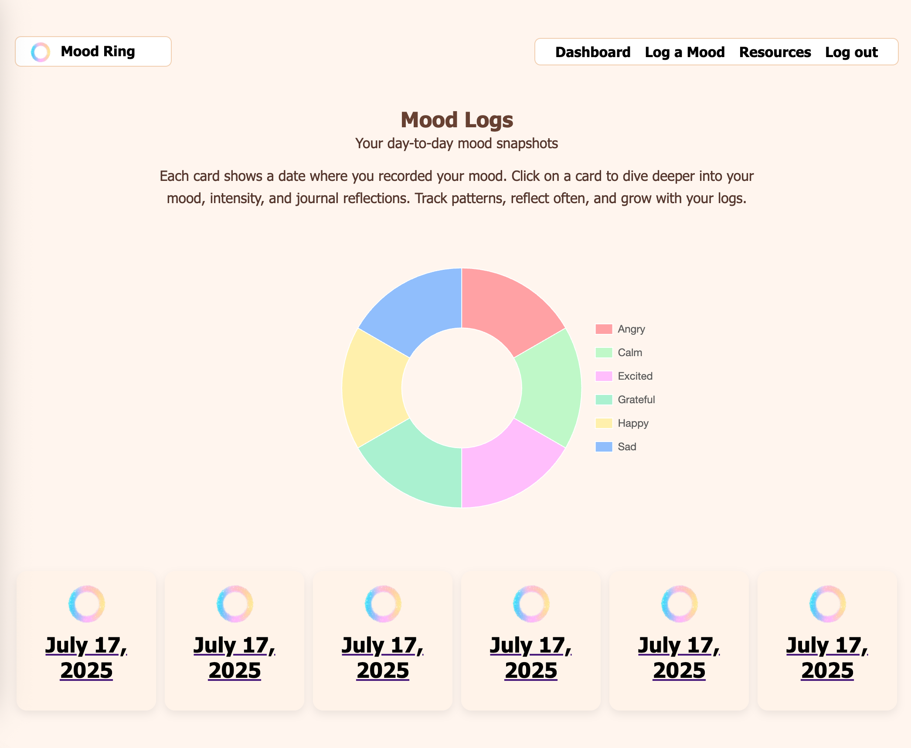
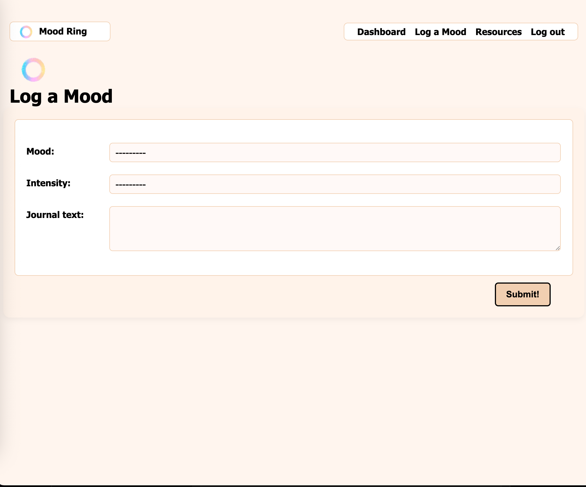
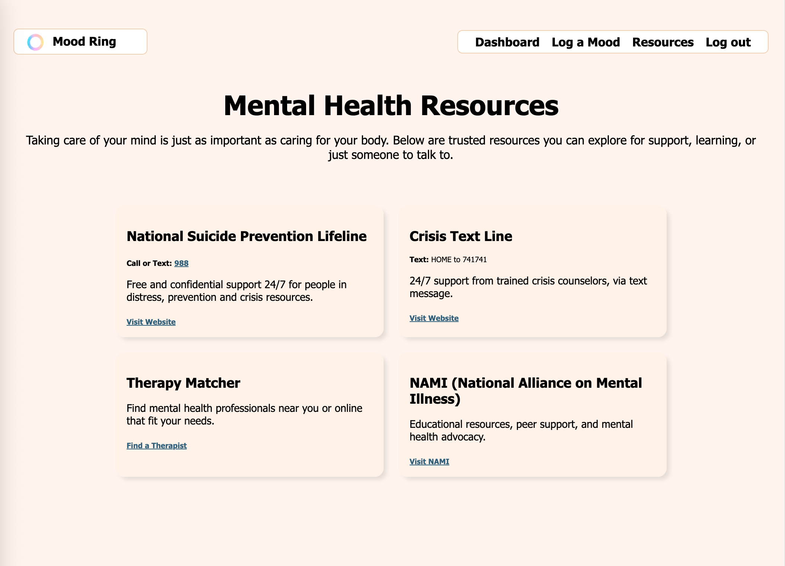

# 🌈 MoodRing

MoodRing is a mood journaling and self-reflection web application that allows users to track their emotional states, log journal entries, and view personal mood history. The app provides a safe, minimalist space to explore mental wellness through color-coded emotional logging.

---

## 🧠 Project Purpose

This project was developed as a team collaboration to explore the intersection of mental health, personal journaling, and web technology. MoodRing encourages mindfulness by letting users capture how they feel daily and reflect on patterns over time.

---

## 💡 Features

- Submit mood entries with emotion name, intensity, and journal notes
- Color-coded mood classification system
- Daily journaling with timestamp
- Mood history tracking
- Optional affirmations for reflection or motivation

---

## 📷 Screenshots

## ## 🌐 Live Site

[MoodRing App](https://moodring-d082a6f2c037.herokuapp.com/)

## 🛠 Technologies Used

- **Python** , **Django & Postgres** – Backend and database management
- **HTML/CSS** – User interface design
- **JavaScript** – Interactive frontend features
- **Neon** – Default development database
- **Gemini AI** - API integration

---

## 👥 Team Members

This project was proudly created by:

- Ashley
- Dia
- Jimmy
- Michael
- Travis

Each team member contributed to various parts of the app, including frontend design, backend development, styling, and debugging.

---

## 📌 Future Improvements

- Add mood trend graphs or analytics
- User authentication with personalized dashboards
- Exportable mood journals
- Daily mood reminders or notifications

---

## 📃 License

MIT License – Free to use, share, and modify with attribution.
